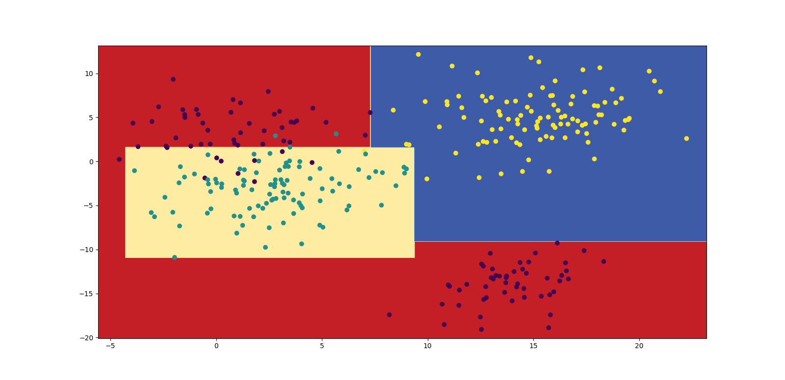

# ML 101 Homework 2: Decision Tree

In this assignment we will implement decision tree model, using only numpy. 

## Implementation
You should implement not implemented methods of `decision_tree.py` file.

### DecisionNode
This is a building block of a decision tree. It contains and stores all 
necessary information about each node of decision tree. This class is already 
implemented.

### DecisionTree
This class contains methods that build a decision tree made of decision nodes. 
You must implement those methods.

####  `_gini`, `_entropy`, `_square_loss`
These are criterion that will be used to determine constrain of splitting data 
into true and false branches. [`_gini`](https://en.wikipedia.org/wiki/Decision_tree_learning#Gini_impurity) and [`_entropy`](https://en.wikipedia.org/wiki/Decision_tree_learning#Information_gain) are suitable for 
classification tasks, [`_square_loss`](https://en.wikipedia.org/wiki/Decision_tree_learning#Variance_reduction) is for regression tasks. 

####  `_iterate`
This is the most important function, it builds the whole decision tree, i.e.
creates nodes with corresponding data. 
This method must
    1. split data in optimal way.
    2. return child decision nodes with data parts
    3. repeat the same for those child nodes

####  predict
It takes the data point with unknown label, and 
determines it label. It uses the node system saved on self.tree to do so.

## Testing
After implementing everything, please run unit tests and make sure your code 
passes all of them.
```
python -m pytest
```
After that you can try to run `plot_results.py` script. If your code works, you 
should  get a plot similar to this one:
```
python plot_results.py
```


